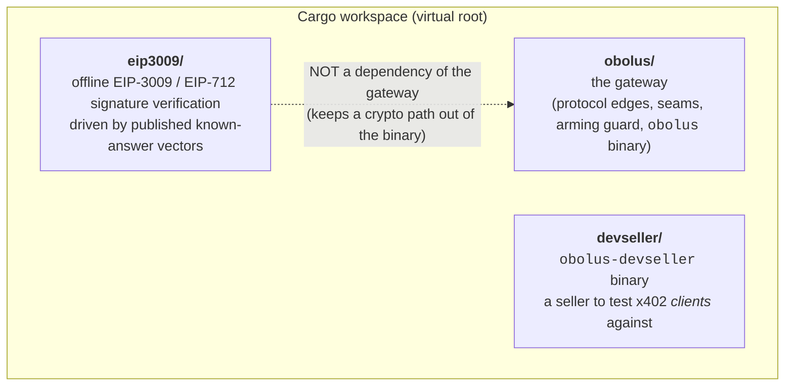
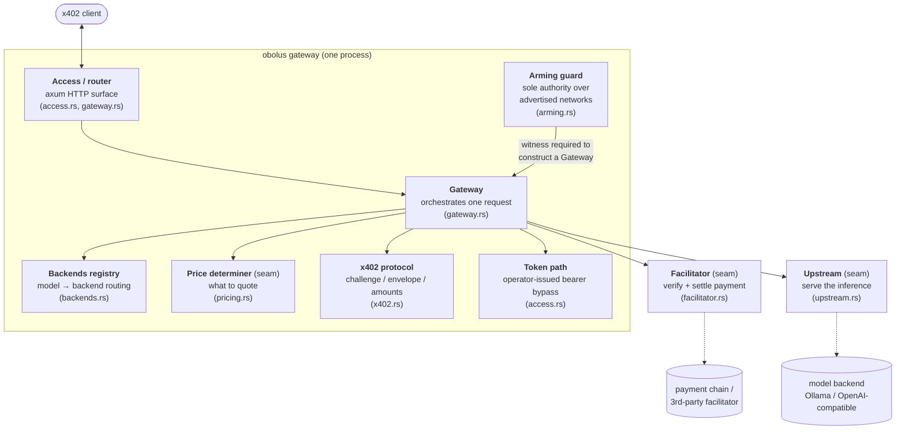
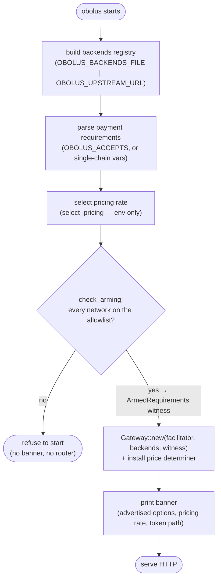
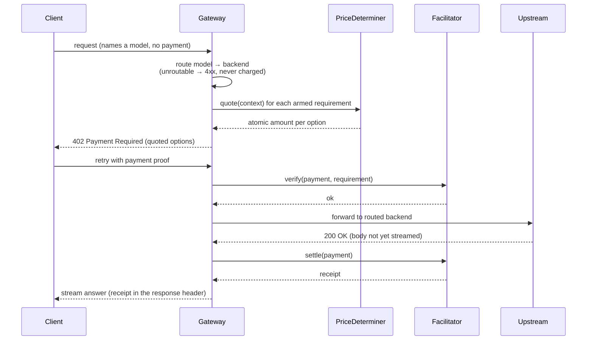
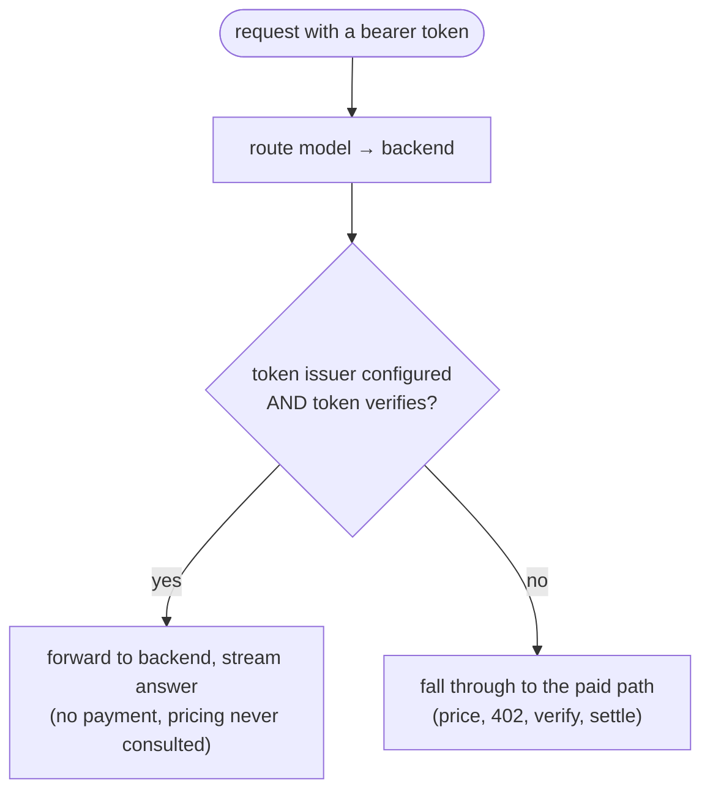

# Obolus — Architecture

This document is the map. It describes what Obolus is, the pieces it is built from, and the
paths a request takes through it — enough that someone who has never seen the code can reason
about where a change belongs. It covers what is built today and names, as *planned*, the shape
the near-term work is growing into.

For *why* the product exists and where it is headed, see [`vision.md`](vision.md). For the
payment protocol itself, if HTTP 402 / x402 is new to you, start with
[`x402-ecosystem.html`](x402-ecosystem.html). For the pricing subsystem in depth, see
[`pricing.md`](pricing.md).

## What Obolus is

Obolus is a **payment-gated serving gateway**: a toll booth in front of an AI or agentic
service. A request that arrives without payment is answered with a real HTTP `402 Payment
Required` challenge naming what to pay and on which chains. The client pays a small USDC
micropayment, retries with proof, and the gateway verifies the payment, forwards the request
to a model backend, settles the payment, and streams the answer back.

Two properties shape everything below:

- **The gateway holds no payment keys and reaches no chain.** Verifying and settling a payment
  happens behind a seam that can run in-process, be extracted to a separately-secured service,
  or be delegated to a third party. The gateway decodes the payment envelope and forwards the
  inner authorization untouched; it never signs. Mainnet is therefore not reachable by
  construction — there is no signing path to misuse.
- **It is stateless.** No database, no admin store, no session. Every request is decided from
  configuration fixed at boot plus the payment presented. This keeps the current build simple
  to run and hermetic to test; a stateful admin/telemetry layer is planned, sequenced after the
  stateless core is complete.

## The workspace

Three crates, one virtual Cargo workspace (the repo root declares members and shared dependency
versions; it is not a package of its own).

- **`obolus/`** is the gateway and the `obolus` binary. Everything in the rest of this document
  lives here unless stated otherwise.
- **`eip3009/`** verifies EIP-3009 / EIP-712 payment signatures offline, checked against
  published known-answer test vectors. It exists for offline verification and dev tooling. It
  is **deliberately not a dependency of the gateway binary** — wiring it in would quietly give
  the binary a cryptographic payment path, which the key-free design forbids. A build step in
  both the Cargo and Bazel jobs fails if the crate enters the gateway's dependency graph.
- **`devseller/`** is a standalone seller (`obolus-devseller`) for testing x402 *client*
  implementations: it issues real challenges, verifies offline, can be told to fail on command,
  settles nothing, refuses non-testnet networks, and binds only to loopback. It is its own
  package, not a second binary under `obolus/`, so that its signature-verification dependency
  cannot leak into the gateway's dependency graph.

## Components

The gateway is a small set of collaborators. Each capability that an operator or a third party
might want to swap sits behind a trait; the concrete implementation is chosen at boot.

**Gateway (`gateway.rs`).** The orchestrator. It holds the routing registry, the facilitator
seam, the price determiner, and the armed requirements witness, and it drives one request from
arrival to settled response. It is generic over the facilitator type (`Gateway<F: Facilitator>`)
and holds the upstreams and the price determiner as trait objects.

**Arming guard (`arming.rs`).** The sole authority over which payment networks the gateway may
advertise. `check_arming` checks every requested network against an allowlist transcribed from
the upstream x402 source (testnets only — the guard has no mainnet entry to enable) and, on
success, returns an `ArmedRequirements` **witness**. That witness has no public constructor, and
`Gateway::new` takes one — so no code path can build a gateway around a network the guard never
admitted, and the check cannot be moved after construction (there is nothing to construct with
until it has passed).

**Backends registry (`backends.rs`).** The set of model backends and the routing between them. A
backend is `(id, kind, base_url, models, precedence, …)`; `kind` is `ollama` or `openai-compat`
today (`anthropic-compat` is a named kind but boot-refused as not-yet-implemented — see the
planned work below). A request naming a model routes to the highest-precedence
backend that serves that alias; a backend with an empty `models` list is a *catch-all* that
serves any request and is legal only as the sole backend. The registry is built at boot from a
JSON file (`OBOLUS_BACKENDS_FILE`) or, for the single-backend case, synthesized from
`OBOLUS_UPSTREAM_URL`. Unroutable requests are refused before any payment is taken — the gateway
has no refund path, so it never charges for work it cannot route.

**Upstream seam (`upstream.rs`).** Serving the inference. The `Upstream` trait is object-safe
(its `forward` returns a boxed future), so the registry can hold heterogeneous backends behind
`Arc<dyn Upstream>`. `OllamaUpstream` speaks the Ollama / OpenAI-compatible wire shape (`POST
/v1/chat/completions`, an optional bearer token). Test-only fakes serve canned bytes and are
absent from shipped artifacts by construction (`#[cfg(test)]`).

**Facilitator seam (`facilitator.rs`).** Verifying and settling payments — the money boundary.
`verify` checks a presented payment against a requirement; `settle` submits it and returns a
receipt. The gateway calls these but never signs. A delegating implementation forwards to an
external facilitator over HTTP; a test-only fake accepts unexamined payments and is absent from
shipped artifacts.

**Price determiner seam (`pricing.rs`).** Deciding the atomic amount to quote for one advertised
payment requirement. This is the subject of [`pricing.md`](pricing.md); the short version is a
`PriceDeterminer::quote(PriceContext) -> u128` trait, called once per advertised requirement and
only on the paying path.

**Token path (`access.rs`).** An optional operator-issued bearer-token bypass. A request carrying
a token the operator's public keys verify is served without payment. This path verifies operator
signatures (it checks a signature, it cannot mint one) and reaches no chain, so it sits outside
the key-free rule on purpose. When no token issuer is configured, the path is off and every
request pays.

**x402 protocol (`x402.rs`).** The payment vocabulary: `PaymentRequirements` (a single advertised
option — scheme, network, asset, pay-to, amount), the challenge and envelope shapes, and
`validate_atomic_amount`, which is the definition of a well-formed atomic amount used across the
gateway.

## The seam pattern

The extensibility model is one shape repeated: a trait per capability, with the concrete backend
chosen at boot. The trait *shape* differs by capability — the facilitator is generic over the
gateway, the upstream and price determiner are trait objects — but the pattern does not. A seam
is what lets an operator (or a third party) replace a capability without patching the gateway:
run settlement in-process or delegate it; serve a local model or a remote API; keep the default
flat price or compute a cost-plus quote.

The seams, and what rides behind each:

| Seam | Trait | Question it answers | Shipped implementations |
|---|---|---|---|
| Fulfillment | `Facilitator` | Is this payment good, and settle it | delegating (HTTP), test fake |
| Upstream | `Upstream` | Serve the inference | Ollama / OpenAI-compatible, test fake |
| Pricing | `PriceDeterminer` | What does this request cost | static, cost-plus (config-selectable); flat (a library rate, not yet wired to config) |

Planned seams named by the vision but not yet built: telemetry/metrics (out-of-process revenue
and cost reporting) and feature-flags/kill-switch (per-backend switches and spend caps).

## Key flows

### Boot: nothing serves until the guard has spoken

The order of startup is load-bearing. Configuration is parsed, the backends and the price rate
are resolved, and only then is arming checked — and no banner is printed and no router is built
until the arming witness exists. A refused configuration must never first advertise a price or a
network it will not honor.

### A paid request

The gateway routes first, prices the routed request, challenges, and only forwards once payment
verifies. It commits the upstream (the `forward` returns once the backend answers `200`, before
the body streams) and *then* settles — deliberately, so a failed settlement serves nothing and
charges nothing. The open gap runs the other way: once settlement succeeds the body streams, and a
stream that then fails partway leaves a client charged for a response they did not fully receive.
The gateway has no refund or retry path for that today; it is the refund / failure question named
under [planned work](#what-is-planned-and-where-it-goes) and in [`pricing.md`](pricing.md), and a
real gap to weigh before running this in production.

### The token bypass

A request bearing a token the operator's keys verify is served without payment. It returns before
pricing is ever consulted — the paid path and the bypass path diverge at the token check.

## Invariants worth knowing before you change things

These hold today; each is easy to break while improving something nearby.

- **No payment cryptography in the gateway crate.** Nothing in `obolus/` checks a payment
  signature, holds a payment key, or submits to a chain — verification and settlement are the
  facilitator's, behind the seam. The bearer-token path is the deliberate exception: it verifies
  operator signatures and reaches no chain.
- **`eip3009` is not a dependency of the gateway binary**, enforced by a CI step in both builds.
- **Test fakes are `#[cfg(test)]`-only**, so no shipped configuration can select "accept every
  payment and serve a canned model."
- **The gateway cannot advertise a network the arming guard never admitted**, enforced by the
  witness type having no public constructor.
- **Nothing Obolus authors decides whether a payment signer is correct.** The load-bearing checks
  are outside its authorship: published known-answer vectors, and real settlement against a
  third-party facilitator on a testnet (deliberately outside the hermetic merge gate).

## What is planned, and where it goes

The near-term milestone is "someone can run this for money": the object-safe backend seam,
structured multi-backend config, model-identity routing, the pricing seam, and minimal
revenue/cost telemetry — all still stateless. The subsystem currently growing is **pricing**:
per-backend cost is the next step, and it lands on the seam and registry already described. See
[`pricing.md`](pricing.md) for that design.

Sequenced after the stateless core: an admin UX and the stateless→stateful transition,
feature-flags / kill-switch, client-key pass-through, Anthropic-compatible routing,
refund / failure semantics, richer telemetry transport, and horizontal-scale shared state. These
are directions the seams are built to honor, not commitments in the current build.
