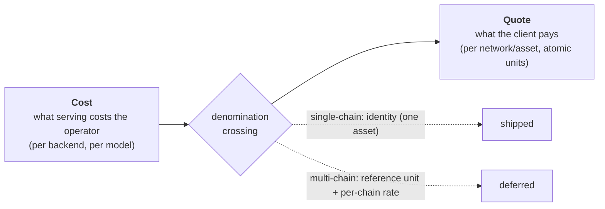
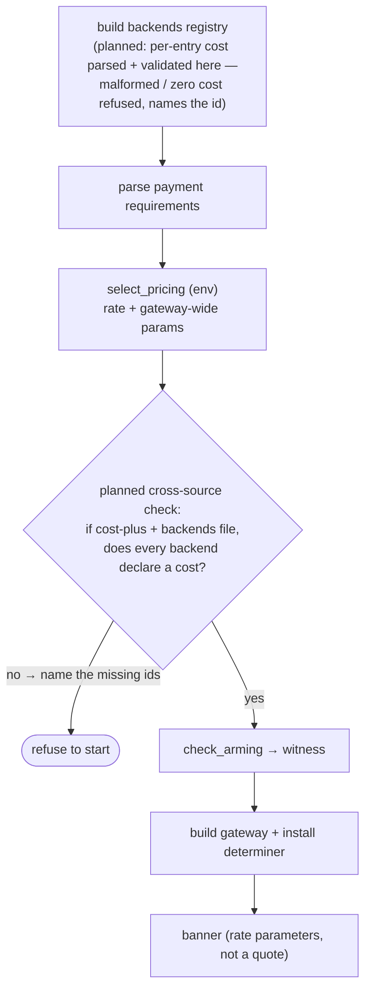

# Obolus — Pricing

This document describes how Obolus decides what a request costs: the design of the pricing
subsystem, the rate structures it supports, how an operator configures them, and the one
question that governs the whole design — *in what units is a price even expressed?*

It assumes the gateway model from [`architecture.md`](architecture.md) (routing, the arming
guard, the seams). It marks clearly what is built today and what is planned.

## The frame: cost and quote are two different denominations

Every pricing decision spans two quantities that are easy to conflate and must not be:

- **Cost** — what serving a request costs *the operator*. A local model has an infrastructure
  cost; a resold API (Grok, Gemini) has a wholesale price the operator pays upstream. Cost is a
  fact about the *supply side*, and it naturally varies by backend, and ultimately by model.
- **Quote** — what the *client* pays, for one advertised payment option, on one chain, in one
  asset. A quote is denominated in **that asset's atomic units** — the smallest indivisible unit
  of the token, e.g. 1 USDC on a 6-decimal chain is 1,000,000 atomic units.

The gateway's job at the seam is to produce a *quote*, in the *requirement's* asset's atomic
units. So a rate that reasons about cost has to cross from one denomination to the other, and
**that crossing needs a denomination assumption**:

> How many atomic units of *this chain's asset* is one unit of *my cost*?

When the gateway advertises exactly one chain, that assumption is trivial: there is one asset, so
"cost in atomic units" and "quote in atomic units" are the same units, and the crossing is the
identity. This is why the cost-plus rate (below) is **single-chain only** — not an arbitrary
limit, but the precise condition under which "cost in atomic units" is well-defined.

When the gateway advertises several chains carrying different assets and decimals, the crossing is
a real conversion — a reference cost unit plus a per-chain rate — and that is deferred work with
its own design (see [Deferred](#deferred-work) below). Keeping the two denominations distinct is
what makes that future work legible as a *bridge* to build, rather than a feature that is somehow
missing.



## The seam

Pricing is a seam: a `PriceDeterminer` chosen at boot decides the amount for one advertised
payment requirement.

```rust
struct PriceContext<'a> {
    model: Option<&'a str>,   // the model the request named, if any
    backend: &'a Backend,     // the backend it routed to (id, kind, models, precedence, …)
    requirement: &'a PaymentRequirements, // the one advertised option being priced
}

trait PriceDeterminer: Send + Sync {
    fn quote(&self, ctx: PriceContext<'_>) -> u128;
}
```

Three properties are load-bearing:

- **A determiner prices the amount and nothing else.** It sees the requirement it is pricing but
  does not choose it — scheme, network, asset, and pay-to are copied through untouched by the
  caller. So a determiner cannot add, drop, or alter an advertised network; the arming guard
  remains the sole authority over which networks are offered. The seam widens *pricing*, not the
  attack surface.
- **Every price it can return is payable.** `quote` returns a `u128`, not a string. A `u128` is by
  definition a non-negative integer in atomic units — exactly what a configured amount is
  validated to be. A determiner therefore cannot compute a quote no conforming client could pay,
  and there is no revalidation step to forget.
- **`quote` must be total, and cheap.** It runs on the request path — including when a 402 is
  issued to an *unpaid* request, to state the challenge amount — so it is reachable by unpaid
  traffic. A panic there is a 500 charged to no one; an expensive or blocking `quote` is a
  denial-of-service surface a custom determiner could open. Determiners return a price on every
  input, quickly and without blocking; the fallible cases fail *closed* (see below), never by
  unwrapping into the hot path.

The determiner is called **once per advertised requirement**, on **every request except the token
bypass** — the bypass returns before pricing is ever consulted, but an unpaid request that gets a
402 is priced, because the challenge has to state the amount. It already receives the routed
`backend` and the request's `model`, so per-backend and per-model policies have the context they
need without any further plumbing.

## Rate structures

### Shipped

**`StaticPrice` — the identity default.** Quotes each requirement at its own configured amount.
This is the behavior a gateway has with no pricing configured: the price is whatever the armed
requirement carried. Its one fallible case — an amount that does not parse as `u128` — quotes
`u128::MAX`, which no client can pay. That is deliberate: a bug must fail closed (refuse to serve)
rather than open (serve for free).

**`FlatPrice` — one rate for everything.** Every advertised requirement is quoted the same amount,
regardless of model, backend, or network. The flat-rate seller's policy: a single price to use
the gateway, whichever chain the client pays on. It exists as a library rate — the `OBOLUS_PRICING`
config door (below) does not yet offer a `flat` selector, so an operator reaches it only in code,
not by configuration.

**`CostPlus` — cost-in, margin-out.** The "run it for money" rate. The operator declares an
upstream cost and a margin, and every request is quoted:

```
quote = cost + floor(cost * margin_bps / 10000)
```

The margin is in **basis points** — `10000` bps = 100%, `2500` = 25%, `250` = 2.5%. Basis points,
not a percentage or a float, so the margin is an exact integer with sub-percent precision and no
float ever enters the money path. The *markup* is in whole atomic units and floored, so a markup
that works out to less than one atomic unit rounds down to zero — the quote is only ever rounded
toward the payer, and by less than one atomic unit. A `0` bps margin quotes the cost exactly, a
legitimate break-even rate. The arithmetic saturates: an absurd cost×margin that would overflow
`u128` yields a quote near the maximum — unpayable — the same fail-closed direction as
`StaticPrice`'s unparseable guard.

As shipped, cost-plus is **gateway-wide and single-chain**: one declared cost, applied to every
request, on the single advertised chain. Per the [frame](#the-frame-cost-and-quote-are-two-different-denominations),
one atomic cost is well-defined only against one asset.

### Planned

**Per-backend cost-plus.** Different backends cost differently — a local model is not priced like
a resold API. The next step lets cost-plus read the *routed backend's* declared cost, so each
backend is marked up from its own cost. This is a cost-side refinement: it does not touch the
denomination crossing, so it stays single-chain. See [The granularity
decision](#the-granularity-decision) for exactly how far it goes and what it deliberately does
not do.

**Promotional and free.** A promotional rate (a temporary discount) and a genuinely free rate.
Free is not just "quote zero" — a zero quote reaches a settle-a-zero-amount path that the paid
flow does not exercise today, so it needs that path confirmed end-to-end first. It is a distinct
rate, not a degenerate cost-plus, which is why cost-plus refuses a zero cost rather than treating
it as free.

## Configuration

The pricing rate is selected by environment variables, parsed at boot by `select_pricing`.

| Variable | Meaning |
|---|---|
| `OBOLUS_PRICING` | The rate: unset or `static` (the default — each option keeps its own configured amount), or `cost-plus`. |
| `OBOLUS_UPSTREAM_COST` | Cost-plus only: the declared upstream cost, in atomic units. Required under `cost-plus`. |
| `OBOLUS_MARGIN_BPS` | Cost-plus only: the margin, in basis points (`10000` = 100%). Required under `cost-plus`. |

### Boot refusals

A gateway that priced wrongly — or advertised an amount it would not charge — is worse than one
that will not start. Every misconfiguration below is a boot refusal, fired **before** the banner,
so a refused configuration never first advertises anything (the same discipline the arming guard
follows). The rate parameters, not a computed quote, are what the banner prints when the gateway
does start: per-backend cost will make quotes vary, so a single boot-time number would drift.

- **Unknown rate.** `OBOLUS_PRICING` names something that is neither `static` nor `cost-plus`
  (a typo, or an unexpanded `${VAR}` that arrived empty) — refused rather than guessed, so a
  mistyped rate never silently falls back to a price the operator did not choose.
- **Missing / malformed / zero cost or margin.** Cost-plus infers no money value, so a missing
  cost or margin is a refusal, not a default. A zero cost is refused specifically: there is
  nothing to mark up (any margin on zero is still zero), and a zero quote would reach the deferred
  zero-settle path. Serving free is a separate rate, not cost-plus.
- **Cost-plus alongside multi-chain `OBOLUS_ACCEPTS`.** One declared cost is ambiguous across
  several networks carrying different assets and decimals — the denomination crossing this rate
  does not yet make. Refused until per-chain cost lands.
- **Cost-plus alongside an explicit `OBOLUS_PRICE`.** Under cost-plus the amount comes from cost
  and margin, so a configured price would sit inert — the silently-ignored-config surprise. Keyed
  on whether the price was *explicitly set*, so an operator who never set it (and gets its
  default) is not refused on a default they do not know exists.
- **Orphaned cost-plus parameters.** `OBOLUS_UPSTREAM_COST` / `OBOLUS_MARGIN_BPS` set without
  `cost-plus` selected would sit inert — refused rather than dropped.

## The granularity decision

The vision names an open question: *at what level does an operator specify prices — global,
per-backend, per-model, per-client?* The [frame](#the-frame-cost-and-quote-are-two-different-denominations)
resolves it by separating the axes.

**Decided:**

- **Per-backend cost** is the level to build. It is the concrete operator need — resold APIs and
  local models have genuinely different costs — and it fits the seam and registry unchanged
  (`PriceContext` already carries the routed backend).
- **Margin stays gateway-wide.** Margin is a business policy, not a per-backend fact. Per-backend
  margin is a trivial later addition if a need appears; it is not built now.

**Deliberately deferred, with the reason:**

- **Per-model cost.** The seam already carries `model`, so this is a config-shape question, not a
  structural one. Deferred because a backend commonly maps to one upstream pricing tier, and
  per-model cost multiplies configuration for a need that has not yet appeared. Deferring it costs
  nothing structurally.
- **Per-client pricing.** Needs a notion of client identity that the stateless gateway does not
  have. Out of scope for the current milestone.
- **Cross-asset (multi-chain) cost-plus.** The denomination crossing. See below.

### How per-backend cost will be declared (planned)

> The rest of this section is the **planned** design for per-backend cost — the config shape and
> the boot refusals it will add. None of it is implemented yet: today cost-plus is gateway-wide
> and single-chain, as [Configuration](#configuration) above describes. It is written here so the
> shape is settled before the code lands.

Cost is a fact about a backend, so it will be declared with the backend. This follows the config
model already in place, where a multi-backend gateway is defined by a JSON file and a
single-backend gateway by environment variables:

- **Single-backend (no backends file).** The existing `OBOLUS_UPSTREAM_COST` is gateway-wide,
  which *is* per-backend when there is one backend — unchanged.
- **Multi-backend (`OBOLUS_BACKENDS_FILE`).** Each backend entry will declare its own `cost`, in
  atomic units, as a string (an atomic amount can exceed the range a JSON number represents
  exactly, and every other atomic amount in the config is already a string). `OBOLUS_MARGIN_BPS`
  will stay gateway-wide.

Two boot refusals will guard this, each modeled on a rule already shipped:

- **A backends file set alongside `OBOLUS_UPSTREAM_COST`** will be refused, unconditionally: if a
  file is present, cost comes from the file. This mirrors the *existing* refusal of a backends
  file alongside `OBOLUS_UPSTREAM_URL` — the file supersedes the single-backend variables.
- **Under cost-plus, every backend in the registry must declare a cost.** A backend without one
  cannot be marked up, and guessing a cost is exactly the fail-open the boot refusals exist to
  prevent. The refusal will name the backends that are missing a cost, so an operator knows what
  to fix. A malformed or zero per-entry cost will be refused where the backend entry is validated
  (the same place a bad `baseUrl` is caught today), naming the offending backend — so the
  cost-coverage check is the clean question "is a cost present on every backend," not "present and
  parseable."

### Where the checks will live in the boot sequence (planned)

Per-backend cost will be declared in the backends file but the rate is selected from the
environment, so cost *completeness* is a cross-source check: it needs both the parsed registry and
the selected rate. It cannot live inside `select_pricing`, which sees the environment only. It
will be a distinct validation stage, run after both parses and before the banner. The diagram
below is the *planned* sequence; the per-entry-cost parsing and the cross-source coverage check
are the two stages it adds to today's boot.



## Deferred work

**Cross-asset (multi-chain) cost-plus — the denomination bridge.** To price cost-plus across
several chains, a declared cost has to be denominated in a **reference unit** (say, a fiat cost or
a chosen reference asset), and each advertised chain needs a **conversion rate** from that
reference unit to the chain's atomic units. That conversion is the real design work: it needs a
rate source, and it introduces staleness (a rate is only as good as its last update) and
cross-decimal rounding — both of which must fail closed (a stale or missing rate refuses to quote
rather than guessing). Until that bridge exists, cost-plus stays single-chain and the multi-chain
combination is refused at boot. The single-chain restriction is not a wart to remove; it is the
absence of a bridge that has not been designed.

**Per-model and per-client cost**, as above — supported by the seam, deferred by config scope.

**Refund / failure semantics.** Paid, then the backend errors or times out: refund, retry, or
credit? The gateway has no refund path today and refuses to charge for work it cannot route, but a
mid-stream failure after settlement is an open question an x402 business ultimately has to answer.
It is a settlement-path concern, adjacent to pricing but not decided by it.
