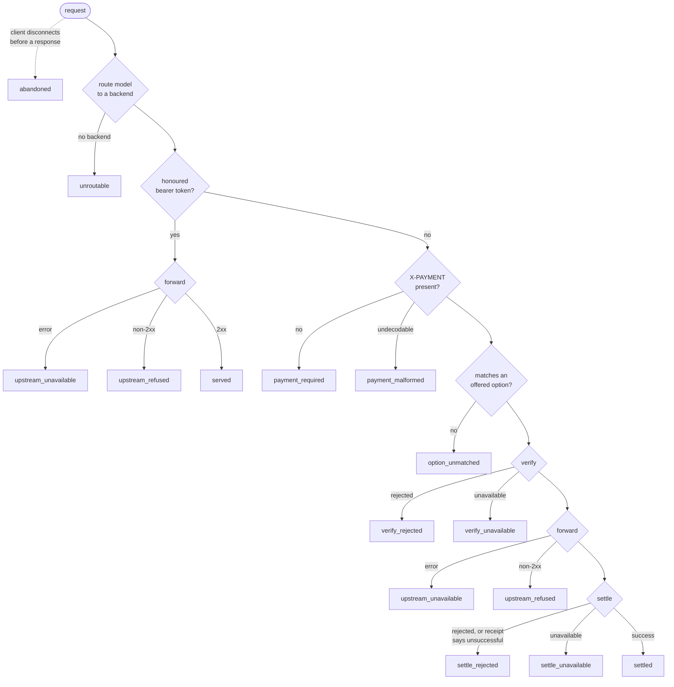

# Obolus — Telemetry

This document describes what Obolus records about each request, so that an operator can reckon
revenue against cost per backend, model, and chain. It covers the seam, the one event per request,
the rules that decide an event's cost and revenue, and the line format an operator's tooling reads.

It assumes the request path from [`architecture.md`](architecture.md) and the cost/quote
vocabulary from [`pricing.md`](pricing.md). It marks what is built today and what is planned.

## Status

- **Built:** the `Telemetry` seam, the per-request event, the accounting rules, the JSON line
  format, and a test sink that asserts the event stream in hermetic tests.
- **Next:** the default sink the `obolus` binary installs — one JSON line per request on stdout,
  written off the request path and dropping (and counting) lines rather than ever blocking a
  request. Until it lands, the binary records nothing: a `Gateway` defaults to a no-op sink. Tracked
  in [#58](https://github.com/geekinasuit/obolus/issues/58).
- **Out of scope:** OpenTelemetry, Kafka, and database transports. The seam is shaped for them; see
  [Adding a transport](#adding-a-transport).

## The seam

```rust
trait Telemetry: Send + Sync {
    fn record(&self, event: RequestEvent);
}
```

A sink is installed with `Gateway::with_telemetry`, the same way a price rate is installed with
`with_price_determiner`. Three properties are load-bearing:

- **One event per request, recorded once.** The completion route keeps a recorder for the request
  and records its event when the recorder is dropped. On a finished request that happens after the
  response is decided, and every exit — including an unroutable request — has to name an outcome
  for the code to compile. When a client disconnects mid-request, the server drops the handler
  wherever it is waiting, and the recorder goes with it, so that request is recorded too, as
  `abandoned`.
- **Recording never fails a request.** `record` returns nothing, and the gateway calls it through a
  wrapper that contains a panicking sink. On a finished request it runs after the response is
  decided — including, on a paid request, the receipt for a charge that has already landed.
- **A sink must not block.** `record` runs on the request path. A sink that does I/O must hand the
  event to a bounded queue and drop, rather than wait, when that queue is full.

## Why one event, not one per stage

The issue asks for request, price-quoted, verify, settle, cost, and revenue. Those are all fields
of **one** terminal record rather than six separate events. A per-stage stream needs a correlation
id to be put back together, and reassembly is where accounting goes wrong: a lost "settled" line
after a kept "verified" line is a request that looks free. A single record can be summed without
being joined to anything.

## Where each request ends

Every request that reaches the completion handler ends in exactly one of these outcomes. A request
the HTTP layer refuses before the handler runs — a wrong method, a body over the size limit, a body
that cannot be read — is not recorded; none of those reach pricing, payment, or a backend.



## Cost and revenue

These two fields are derived from the outcome and whether the upstream was called. The gateway
never sets them directly, so the rules live in one place.

| Field | Rule |
|---|---|
| `cost` | The routed backend's **declared** per-request cost if the upstream was called, `"0"` if it was not, and `null` if it was called but the backend declares no cost. |
| `revenue` | The paid option's amount on `settled`; `null` on `settle_unavailable`, and on `abandoned` once settlement had begun; `"0"` on every other outcome. |

The details that matter:

- **A cost is charged whenever the upstream was called**, however the request then ended. The case
  this exists to expose is a request whose upstream served and whose settlement then failed: the
  backend did the work and nothing was charged. That is `settle_rejected` with a non-zero `cost` and
  `revenue: "0"`. An `upstream_unavailable` or `upstream_refused` also carries the declared cost:
  whether a backend bills a failed or refused call depends on the backend and is not knowable from
  the gateway, and overstating a loss is the safer error than hiding one.
- **An unknown cost is `null`, never `"0"`.** Under the static rate no backend declares a cost, so
  every served request records `cost: null`. A zero would read as free. Revenue-versus-cost is
  computable only under the cost-plus rate, where every backend is required to declare a cost.
- **Revenue is the price charged, a lower bound on what moved.** It is the quoted amount of the
  option the payment matched. x402's `exact` scheme accepts an authorization for *at least* that
  amount, the settlement receipt carries no amount of its own, and the gateway never opens the
  payment payload — so a client that authorized more than the quote may have been settled for more
  than `revenue` says. Summed revenue can undercount; it never overcounts.
- **`settle_unavailable` records no revenue**, and neither does an `abandoned` request whose
  settlement had begun. The settle call may or may not have landed; whether funds moved on chain is
  not something the gateway can know. Reconcile these against the chain using the paid option's
  network and asset.
- **`settled` means the charge landed when the upstream's response head arrived**, not that the
  whole body reached the client. A stream that dies after settlement is still `settled`. This is
  the known gap described in [`architecture.md`](architecture.md#a-paid-request).
- **Token-path requests carry cost and no revenue.** They are served without payment, so they are
  pure cost to the operator — worth seeing, not hiding.

## The line format

A sink that writes text writes each event as one line of JSON. This is the contract an operator's
tooling reads. The example below is a copy of the line the test
`the_json_line_matches_the_documented_schema` (in `obolus/src/telemetry.rs`) pins the code to, so
that test is the authority if the two ever disagree.

```json
{"v":1,"ts_ms":1700000000000,"outcome":"settled","access":"payment","backend":"local","model":"llama3","offers":[{"scheme":"exact","network":"test-network","asset":"0xTEST-ASSET","amount":"1000"}],"paid":{"scheme":"exact","network":"test-network","asset":"0xTEST-ASSET","amount":"1000"},"upstream_invoked":true,"upstream_status":200,"cost":"800","revenue":"1000","transaction":"0xTEST-TX"}
```

| Key | Type | Meaning |
|---|---|---|
| `v` | integer | Line format version, currently `1`. Bumped when a field changes meaning or is removed. Adding a field does not bump it, so ignore keys you do not know. |
| `ts_ms` | integer | Unix milliseconds when the event was recorded, stamped once by the gateway rather than by each sink. |
| `outcome` | string | One of the outcomes above. |
| `access` | string \| null | `"payment"` or `"token"`; `null` only for `unroutable`, which is decided first. |
| `backend` | string \| null | The routed backend's id; `null` when unroutable. |
| `model` | string \| null | The model the request named, cut to at most 256 bytes; `null` if it named none. |
| `offers` | array | Every option quoted to this request, at its determined price. Empty off the payment path. |
| `paid` | object \| null | The offered option the payment matched, once one did. |
| `upstream_invoked` | bool | Whether the upstream was called. |
| `upstream_status` | integer \| null | The upstream's response status, when it produced one. |
| `cost` | string \| null | See [Cost and revenue](#cost-and-revenue). |
| `revenue` | string \| null | See [Cost and revenue](#cost-and-revenue). |
| `transaction` | string \| null | The settlement transaction, on `settled` when the facilitator reported one. |

Every key is always present, `null` where it does not apply, so a consumer reads a fixed set of
keys. Every amount is a decimal string of atomic units, the same shape as `maxAmountRequired`,
because an amount can exceed what a JSON number holds exactly.

### What is never recorded

The bearer token, the payment payload, the request and response bodies, the payer's address, and
any free-text error. Facilitator reasons and transport errors can name internal hosts, so they go
to stderr; an event says only *which* outcome occurred.

The stream is pseudonymous, not anonymous: a settled event carries the settlement `transaction`,
and on a public chain that transaction names the payer to anyone who looks it up. Treat the stream
with the care that implies.

## Reading it: revenue against cost per channel

"Channel" is not fixed by the product yet, so every event carries each dimension it could mean:
the backend, the model, and the paid option's network and asset. Group by whichever you need and
sum `revenue` and `cost`.

`cost` and `revenue` are only comparable when they are in the same units, and today that holds
exactly when the cost-plus rate is in use. Cost-plus is single-chain, so a backend's declared cost
and the one advertised asset are the same atomic units (see [`pricing.md`](pricing.md)). Summing
revenue across two different assets, or comparing a multi-chain revenue against a cost, needs the
denomination bridge that pricing has not built yet.

## Adding a transport

A transport is a `Telemetry` implementation that serializes the event (or maps its fields onto its
own schema) and ships it. To keep the request path safe, it should take the shape the default sink
is being built to:

- `record` enqueues onto a bounded channel with a non-blocking send, and returns;
- a dedicated thread or task drains the channel into the transport;
- a full channel drops the event and counts the drop, and the count is reported somewhere the
  operator will see it, so loss is never silent.

Events still in the queue when the process exits are lost. A transport that must not lose events
belongs out of process, which is the direction [`vision.md`](vision.md) sets for telemetry.
